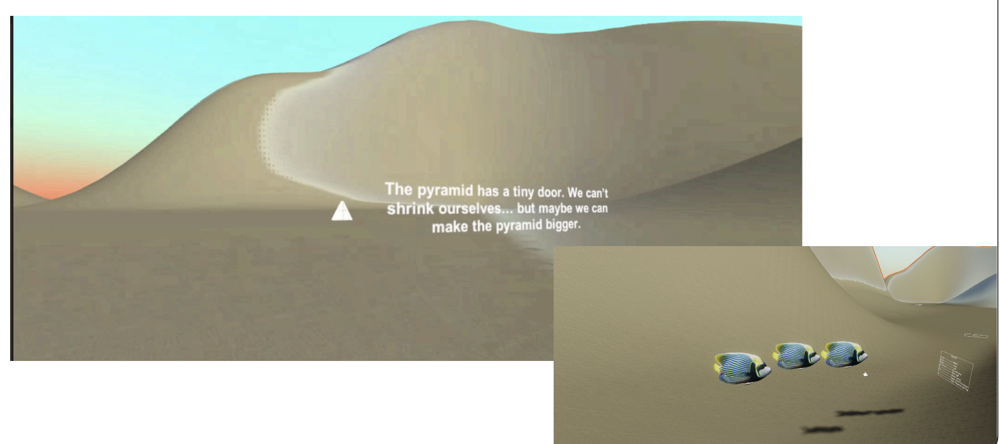
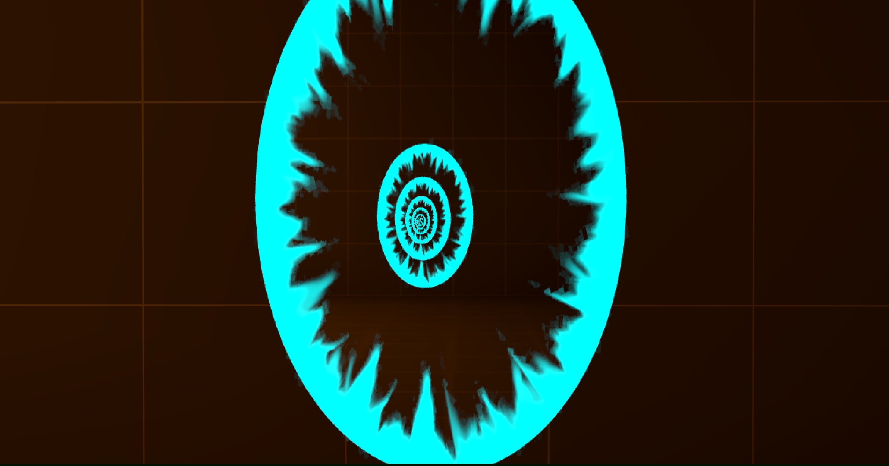
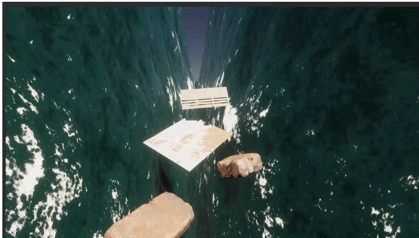
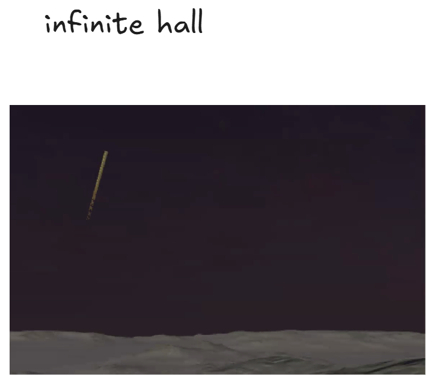

# 🌀 LiminalPortalVR — Portal with Liminal Spaces

A VR puzzle-exploration game built in **Unity** for the **Meta Quest 3**, inspired by *Superliminal*-style optical illusions and non-Euclidean portal mechanics. Step into paintings hanging in a mysterious museum and explore surreal worlds — desert landscapes, industrial galleries, and more — where space itself bends to deceive you.

> **Languages:** C# · ShaderLab · HLSL  
> **Engine:** Unity (URP)  
> **Target Platform:** Meta Quest 3 / Apple Vision Pro  

---

## Table of Contents

1. [Project Overview](#project-overview)  
2. [Key Features](#key-features)  
3. [Directory Structure](#directory-structure)  
4. [Installation Guide](#installation-guide)  
5. [Environment Configuration](#environment-configuration)  
6. [User Manual](#user-manual)  
7. [Technical Architecture](#technical-architecture)  
8. [Team & Credits](#team--credits)  
9. [License](#license)  

---

## Project Overview

LiminalPortalVR places the player inside a museum gallery where paintings serve as portals into entirely different worlds. Each world uses non-Euclidean geometry, forced-perspective tricks, and portal rendering to create puzzles that defy the player's spatial expectations. Objects change size when grabbed and moved through doorways, infinite corridors loop back on themselves, and the rules of perspective become the core game mechanic.

The project is a Unity VR application written primarily in C# with custom HLSL/ShaderLab shaders for portal rendering, skybox transitions, and environmental effects.

---

## Key Features

- **Non-Euclidean Portal System** — Seamless portal rendering that lets players look through and walk into paintings, transitioning between worlds without loading screens. Portals handle size manipulation and spatial illusion logic in real time.
- **Forced-Perspective Puzzles** — Superliminal-inspired mechanics where objects scale dynamically based on the player's viewpoint and distance, creating optical-illusion-based puzzle gameplay.
- **Physics Interaction Layer** — XR grab logic with angular velocity clamping, linear damping, weight-based puzzle mechanics, haptic feedback, and soft-collision buffer volumes at portal seams.
- **Spatial Audio** — Material-specific footstep sounds (marble, water, concrete), reverb zones per environment, and spatial audio "hums" synced with portal VFX.
- **Custom Shader Pipeline** — Horizon blending shaders, skybox transition logic, sand sparkle LUT shaders, and portal transition effects — all optimized to maintain 90 FPS on-device.
- **Comfort VR Suite** — Peripheral vignetting during movement, snap-turn toggle, and teleportation options to mitigate motion sickness.
- **Multi-Environment Worlds** — Museum hub, desert landscape, and industrial gallery environments with baked lighting, light probes, and post-processing polish.

---

## Directory Structure

```
LiminalPortalVR/
│
├── Assets/                        # All Unity project assets
│   ├── Scenes/                    # Unity scenes (Museum, Desert, Industrial Gallery)
│   ├── Scripts/                   # C# gameplay and system scripts
│   │   ├── Portal/                # Portal rendering, transition, and size-manipulation logic
│   │   ├── Physics/               # XR grab, angular velocity clamping, soft-collision volumes
│   │   ├── Interaction/           # Puzzle mechanics, object placement, weight-based triggers
│   │   ├── Audio/                 # Spatial audio controllers, footstep decal logic
│   │   ├── VR/                    # Comfort vignette, snap-turn, teleportation, XR rig config
│   │   └── Utility/               # Helper scripts, debug tools
│   ├── Shaders/                   # Custom ShaderLab/HLSL shaders
│   │   ├── PortalTransition/      # Portal rendering and stencil shaders
│   │   ├── Skybox/                # Horizon blending and skybox transition shaders
│   │   └── Effects/               # Sand sparkle LUT, environmental VFX shaders
│   ├── Materials/                 # Unity materials referencing custom shaders
│   ├── Models/                    # 3D models (museum assets, paintings, props, desert clutter)
│   ├── Textures/                  # Texture maps (albedo, normal, wear-and-tear overlays)
│   ├── Animations/                # Hand animations, door animations, object interactions
│   ├── Audio/                     # Sound effects (footsteps, ambient, portal hums, wind)
│   ├── Prefabs/                   # Reusable prefab objects (portals, interactables, VFX)
│   ├── VFX/                       # Visual effects (fire particles, portal glow, sparkle systems)
│   ├── Lighting/                  # Baked lightmaps, light probe data, reflection probes
│   └── Plugins/                   # Third-party plugins and XR SDK packages
│
├── Packages/                      # Unity Package Manager manifests
├── ProjectSettings/               # Unity project configuration (quality, input, XR settings)
├── .vscode/                       # VS Code workspace settings
│
├── ComputeCommandBuffer.cs        # Rendering command buffer interfaces (compute pipeline)
├── IBaseCommandBuffer.cs          # Base command buffer interface
├── IComputeCommandBuffer.cs       # Compute command buffer interface
├── IRasterCommandBuffer.cs        # Raster command buffer interface
├── IUnsafeCommandBuffer.cs        # Unsafe command buffer interface
├── RasterCommandBuffer.cs         # Raster command buffer implementation
├── UnsafeCommandBuffer.cs         # Unsafe command buffer implementation
│
├── LiminalPortalVR.slnx           # Visual Studio solution file
├── PortalVR.slnx                  # Alternate Visual Studio solution file
├── .gitignore                     # Git ignore rules (Library/, Temp/, Builds/, etc.)
├── .vsconfig                      # VS component configuration
└── README.md                      # This file
```

### Root-Level Command Buffer Files

The `*CommandBuffer.cs` and `I*CommandBuffer.cs` files at the repository root define custom rendering command buffer interfaces and implementations. These are used by the portal rendering pipeline to issue low-level GPU draw calls for stencil-based portal views and compute shader passes independently of Unity's default rendering path.

---

## Installation Guide

### Prerequisites

| Requirement | Version |
|---|---|
| **Unity Editor** | 2022.3 LTS or later (URP) |
| **Meta XR SDK** | v60+ (via Unity Package Manager) |
| **Target Device** | Meta Quest 3 (or Apple Vision Pro) |
| **Operating System** | Windows 10/11 or macOS (for development) |
| **Git** | 2.x+ |
| **Git LFS** | Required if large binary assets are tracked |

### Step 1 — Clone the Repository

```bash
git clone https://github.com/Mundzuk-Uldin/LiminalPortalVR.git
cd LiminalPortalVR
```

If the repo uses Git LFS for textures or models:

```bash
git lfs install
git lfs pull
```

### Step 2 — Open in Unity

1. Open **Unity Hub**.
2. Click **Open → Add project from disk** and navigate to the cloned `LiminalPortalVR/` folder.
3. Unity Hub will detect the project version. If prompted, install the matching Unity Editor version.
4. Wait for Unity to import all assets. The initial import may take several minutes as shaders compile and lightmaps regenerate.

### Step 3 — Install Required Packages

Open **Window → Package Manager** and verify the following packages are installed:

- **XR Interaction Toolkit** (for grab logic and XR rig)
- **Meta XR SDK** or **OpenXR Plugin** (for Quest 3 support)
- **Universal Render Pipeline (URP)** (rendering pipeline)
- **TextMeshPro** (UI text rendering)

If any are missing, add them via the Package Manager's **Unity Registry** tab.

### Step 4 — Configure Build Target

1. Go to **File → Build Settings**.
2. Select **Android** as the platform.
3. Click **Switch Platform** (this may trigger a re-import).
4. Under **Player Settings → XR Plug-in Management**, enable **Meta Quest** (or **OpenXR**).
5. Set **Minimum API Level** to Android 10 (API 29) or higher.

### Step 5 — Build and Deploy

1. Connect your Meta Quest 3 via USB (ensure Developer Mode is enabled on the headset).
2. In **Build Settings**, click **Build and Run**.
3. Select an output folder for the `.apk`.
4. Unity will compile, build, and deploy directly to the headset.

---

## Environment Configuration

### Render Pipeline

The project uses the **Universal Render Pipeline (URP)**. The URP asset is located in `Assets/` and is pre-configured for VR with the following settings:

- **Rendering:** Forward rendering path (required for stencil-based portals)
- **Anti-Aliasing:** MSAA 4x
- **HDR:** Enabled for bloom and post-processing
- **Target Frame Rate:** 90 FPS (locked for VR comfort)

### Lighting

Scenes use a hybrid lighting approach combining baked and dynamic lights for performance on mobile VR hardware. Lightmaps and light probe data are stored under `Assets/Lighting/`. If lightmaps appear missing after cloning, rebake by going to **Window → Rendering → Lighting** and clicking **Generate Lighting**.

### XR Rig

The XR rig is configured with:

- **Continuous Move + Snap Turn** (configurable at runtime via the Comfort settings menu)
- **Peripheral vignette** that activates during locomotion
- **Haptic feedback** normalized across controller types
- **Right joystick** for camera control with 30-degree snapping angles

---

## User Manual

### Getting Started

1. **Launch the application** on your Meta Quest 3. You will spawn inside the **Museum** — a gallery space with paintings on the walls.
2. **Look around** using head tracking. Use the **right joystick** for snap-turn rotation.
3. **Move** with the **left joystick** (continuous locomotion) or use teleportation if enabled in the Comfort menu.

### Core Gameplay

#### Exploring Portals

Walk up to any painting in the museum and look through it — you will see a different world rendered in real time on the other side. Step through the painting frame to enter that world (e.g., the Desert, the Industrial Gallery). To return, find the portal frame within the world and step back through.

#### Interacting with Objects

- **Grab objects** by reaching toward them and pressing the **grip trigger** on your controller.
- Objects respond to physics: they have weight, momentum, and angular velocity that affect how they behave when thrown or placed.
- Some objects change size based on your perspective when carried through portals or doorways — this is the core puzzle mechanic.

#### Solving Puzzles

Puzzles are based on manipulating perspective and object scale. For example, a small object viewed from far away may appear large; carry it to a specific location and it retains the perceived size. Place scaled objects on pressure plates or pedestals to trigger progression events in the museum.

### Comfort Settings

Access comfort options through the in-experience settings menu:

| Setting | Description |
|---|---|
| **Snap Turn** | Toggle between smooth rotation and 30° snap increments |
| **Comfort Vignette** | Darkens the peripheral vision during movement to reduce motion sickness |
| **Teleportation** | Enables point-and-teleport locomotion as an alternative to continuous movement |

### Tips

- If you feel disoriented after a portal transition, stand still and look around to reorient yourself.
- Pay attention to the spatial audio cues — portal "hums" get louder as you approach a transition point.
- Footstep sounds change with the surface material (marble in the museum, sand in the desert), which can help you identify where you are.

---

## Technical Architecture

### Portal Rendering Pipeline (First EVER URP Open Source Recursive Portals)

Portals use stencil-buffer rendering to display a secondary camera's view on the portal surface. The custom `CommandBuffer` classes at the repository root manage the GPU draw calls that render the destination scene into the portal frame without standard Unity camera overhead. The portal shader handles depth masking so that objects occlude correctly across the boundary.
Moreover, a custom URP configuration is used to create a recursion system for the portals where through the use of old frames we can give the illusion of infinite recursion without wasting system resources making it run smooth on the Meta Quest 3 and 2.


### Physics System

The physics layer implements angular velocity clamping and linear damping to keep grabbed objects stable in VR. A "soft-collision" buffer volume at portal seams prevents objects from clipping during transitions. The interaction layer map defines which objects can be grabbed, which are static, and which respond to weight-based puzzle triggers.

### Shader Stack

| Shader | Purpose |
|---|---|
| Portal Transition | Stencil-based view into destination world |
| Horizon Blending | Seamless skybox-to-terrain transitions in the desert |
| Sand Sparkle (LUT) | Lookup-texture-driven sparkle on desert surfaces |
| Skybox Transition | Animated sky changes between environments |
### Audio Architecture

Spatial audio is handled through Unity Audio Sources with 3D spatialization. Reverb Zones are placed per environment (e.g., high reverb in the museum, dry and open in the desert). Footstep logic uses raycasting to detect the ground material and trigger the corresponding audio clip.

---

## Team & Credits

| Member | Role |
|---|---|
| **Ruben Hadjes** | Physics systems, XR grab logic, forced-perspective mechanics, interaction layer mapping |
| **Miguel Pineda** | Portal system, custom shaders (horizon, skybox, portal transition), repository management |
| **Isaac Lugo** | Lighting (baked lights, light probes), post-processing, project/build management, Trello |
| **Sofia Di Lorenzo** | World building (desert, industrial gallery), spatial audio integration, walkthrough video |
| **Mario Domenech** | 3D asset creation, texturing (wear-and-tear), hand animations, sound effects library |

---

## License

This project was developed as an academic capstone. See the repository for any applicable license terms.

---

*Built with Unity · Designed for Meta Quest 3 · Inspired by Superliminal and non-Euclidean geometry*
